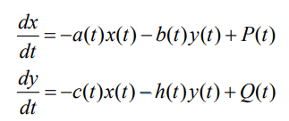
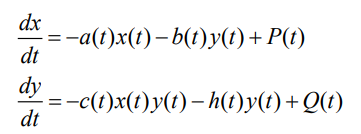
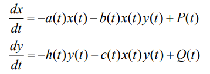
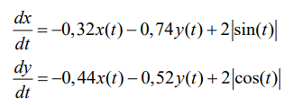
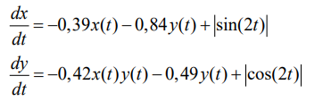

# **Отчет по лабораторной работе №3**
## **Модель боевых действий**
#### вариант 39
#### *Хизриева Рисалат НФИбд-03-19*
---


## **Содержание**
1. Цели работы
2. Задание
3. Выполнение лабораторной
4. Выводы
---


### **Цели работы**
Рассмотреть модель боевых действий - модель Ланчестера.

---

### **Задание**
* Рассмотрите 2 модели боя.
* Построить графики изменения численности войск
* Определить победителя

---

### **Выполнение лабораторной работы**
#### *3.1 Теоритические сведения*

Рассмотрим три случая ведения боевых действий:

1. Боевые действия между регулярными войсками
2. Боевые действия с участием регулярных войск и партизанских
отрядов
3. Боевые действия между партизанскими отрядами 

---

В первом модель боевых действий между регулярными войсками
описывается следующим образом



---

Во втором случае в борьбу добавляются партизанские отряды. В результате модель принимает вид:



---

Модель ведение боевых действий между партизанскими отрядами с учетом
предположений, сделанном в предыдущем случаем, имеет вид:



---


#### *3.2 Задача*

Между страной Х и страной У идет война. Численность состава войск
исчисляется от начала войны, и являются временными функциями
x(t) и y(t). В начальный момент времени страна Х имеет армию численностью 21 050 человек, а
в распоряжении страны У армия численностью в 8 900 человек. Для упрощения
модели считаем, что коэффициенты a, b, c, h постоянны. Также считаем P(t) и Q(t) непрерывные функции.
Постройте графики изменения численности войск армии Х и армии У для
следующих случаев:

---

1. Модель боевых действий между регулярными войсками:




                              График решения для случая 1

---

* Код для решения 1 случая задачи
```
model lab3
  parameter Real a=0.32;
  parameter Real b=0.74;
  parameter Real c=0.44;
  parameter Real d=0.52;
  
  Real x(start=21050);
  Real y(start=8900);
  
equation

  der(x)=-a*x-b*x+2*sin(time);
  der(y)=-c*y-d*y+2*cos(time);
  
  annotation(experiment(StartTime=0, StopTime=1, Tplerance=1e-06, Interval=0.05));

end lab3;
```
---

2. Модель ведение боевых действий с участием регулярных войск и партизанских отрядов:




                              График решения для случая 2

---


* Код для решения 2 случая задачи
```
model lab3_2
  parameter Real a=0.39;
  parameter Real b=0.84;
  parameter Real c=0.42;
  parameter Real d=0.49;
  
  Real x(start=21050);
  Real y(start=8900);
  
equation

  der(x)=-a*x-b*x+sin(2*time);
  der(y)=-c*x*y-d*y+cos(2*time);
  
  annotation(experiment(StartTime=0, StopTime=1, Tplerance=1e-06, Interval=0.05));

end lab3_2;
```
---


### **Выводы**
В ходе выполнения лабораторной работы мы познакомились с моделью Ланчестера. Проверили, как работает модель в различных ситуациях и построили графики для рассматриваемых случаев.