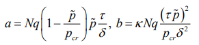

# **Отчет по лабораторной работе №8**
## **Модель конкуренции двух фирм**
#### вариант 39
#### *Хизриева Рисалат НФИбд-03-19*


## **Содержание**
1. Цели работы
2. Задание
3. Выполнение лабораторной
4. Выводы


### **Цели работы**
Цель данной лабораторной работы изучить и разобраться в модели конкуренции

### **Задание**
* Постройте
графики изменения объемов оборотных средств каждой фирмы. Рассмотрите
два случая.
* Проанализируйте полученные результаты.
* Найдите стационарное состояние системы для первого случая.

### **Выполнение лабораторной работы**
#### *3.1 Теоритические сведения*

N – число потребителей производимого продукта

τ – длительность производственного цикла

p – рыночная цена товара

p̃– себестоимость продукта, то есть переменные издержки на производство единицы
продукции

q – максимальная потребность одного человека в продукте в единицу времени

Функция спроса:


Уравнение динамики оборотных цен:


Уравнение для рыночной цены:


При заданном M уравнение описывает быстрое стремление цены к
равновесному значению цены, которое устойчиво. В этом случае уравнение для рыночной цены можно заменить алгебраическим соотношением


Тогда равновесное значение цены p будет равно следующему выражению


Уравнение динамики оборотных средств


Стационарное состояние

, где 

При больших постоянных издержках *(d^2<4b)* стационарных состояний нет.
При *b<<a* стационарные состояния M равны


#### *3.2 Задача*

Рассмотрим две фирмы, производящие взаимозаменяемые товары
одинакового качества и находящиеся в одной рыночной нише. Считаем, что в рамках
нашей модели конкурентная борьба ведётся только рыночными методами.Будем считать, что постоянные издержки пренебрежимо малы, и в
модели учитывать не будем. В этом случае динамика изменения объемов продаж
фирмы 1 и фирмы 2 описывается следующей системой уравнений:


Для обоих случаев рассмотрим задачу со следующими начальными условиями и
параметрами: 

```
p_cr = 22; N = 33; q = 1; tao1 = 22; tao2 = 11; p1 = 6.6; p2 = 11.1; M1 = 3.3; M2 = 2.3;
```


* Код и график для случая 1:
```
model Lab8_1
  parameter Real p_cr = 22;
  parameter Real N = 33;
  parameter Real q = 1;
  parameter Real tao1 = 22;
  parameter Real tao2 = 11;
  parameter Real p1 = 6.6;
  parameter Real p2 = 11.1;
  
  parameter Real a1 = p_cr/(tao1*tao1*p1*p1*q*N);
  parameter Real a2 = p_cr/(tao2*tao2*p2*p2*q*N);
  parameter Real b = p_cr/(tao1*tao1*p1*p1*tao2*tao2*p2*p2*N*q);
  parameter Real c1 = (p_cr-p1)/(tao1*p1);
  parameter Real c2 = (p_cr-p2)/(tao2*p2);
  
  Real M1(start=3.3);
  Real M2(start=2.3);


equation
  der(M1) = M1-(b*M1*M2)/c1-(a1*M1*M1)/c1;
  der(M2) = (c2*M2)/c1-(b*M1*M2)/c1-(a2*M2*M2)/c1;
  
  annotation(experiment(StartTime=0, StopTime=20, Tpierance=1e-06, Interval=0.05));

end Lab8_1;
```


Рассмотрим модель, когда, помимо экономического фактора
влияния (изменение себестоимости, производственного цикла, использование
кредита и т.п.), используются еще и социально-психологические факторы –
формирование общественного предпочтения одного товара другому, не зависимо от
их качества и цены. В этом случае взаимодействие двух фирм будет зависеть друг
от друга, соответственно коэффициент перед
M M1 2
будет отличаться. Пусть в
рамках рассматриваемой модели динамика изменения объемов продаж фирмы 1 и
фирмы 2 описывается следующей системой уравнений:


* Код и график для случая 2:

```
model Lab8_2
  parameter Real p_cr = 22;
  parameter Real N = 33;
  parameter Real q = 1;
  parameter Real tao1 = 22;
  parameter Real tao2 = 11;
  parameter Real p1 = 6.6;
  parameter Real p2 = 11.1;
  
  parameter Real a1 = p_cr/(tao1*tao1*p1*p1*q*N);
  parameter Real a2 = p_cr/(tao2*tao2*p2*p2*q*N);
  parameter Real b = p_cr/(tao1*tao1*p1*p1*tao2*tao2*p2*p2*N*q);
  parameter Real c1 = (p_cr-p1)/(tao1*p1);
  parameter Real c2 = (p_cr-p2)/(tao2*p2);
  
  parameter Real d = 0.00093;
  
  Real M1(start=3.3);
  Real M2(start=2.3);


equation
  der(M1) = M1-(b*M1*M2)/c1-(a1*M1*M1)/c1;
  der(M2) = (c2*M2)/c1-(b/c1+d)*M1*M2-(a2*M2*M2)/c1;
  
  annotation(experiment(StartTime=0, StopTime=20, Tpierance=1e-06, Interval=0.05));

end Lab8_2;
```


### **Выводы**
В ходе выполнения лабораторной работы была изучена модель конкуренции двух фирм и построены их графики.